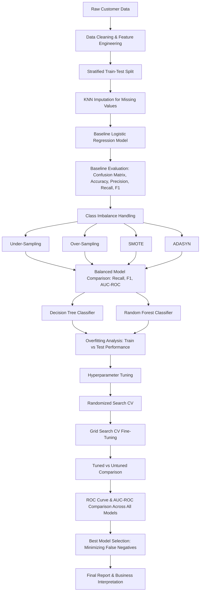

# Supervised-Learing-3
Production-grade credit risk prediction pipeline featuring data preprocessing, class imbalance handling, Logistic Regression, Decision Tree, Random Forest, hyperparameter tuning, and ROC-AUC based model selection.
# Risk Alert Classifier

An early-warning classification system built for a digital banking platform to identify high-risk customers who are likely to default on payments or engage in fraudulent behavior, using an imbalanced customer dataset.

## Operations Performed

- Reviewed core classification concepts: Logistic Regression, performance metrics, Type-I/Type-II errors, Precision/Recall/F1/TPR/FPR, and AUC-ROC
- Identified input features and the target variable (`risk_status`)
- Performed a stratified train-test split to preserve class distribution
- Detected missing values and applied KNN Imputer for multivariate imputation
- Built a Logistic Regression baseline model and evaluated it with a confusion matrix, accuracy, precision, recall, and F1-score
- Identified Type-I and Type-II errors from the confusion matrix
- Measured the impact of class imbalance on model performance
- Applied Under-Sampling, Over-Sampling, SMOTE, and ADASYN, and retrained the model on each
- Compared balancing techniques using Recall, F1-Score, and AUC-ROC
- Implemented Decision Tree and Random Forest classifiers
- Analyzed overfitting by comparing training vs testing performance
- Applied Randomized Search CV to tune Decision Tree and Random Forest hyperparameters
- Applied Grid Search CV to fine-tune the best-performing model
- Compared tuned vs untuned model performance
- Plotted and interpreted ROC curves for all models
- Computed and compared AUC-ROC scores across models
- Selected the best final model based on business priorities (minimizing false negatives)
- Compiled a final report with model justification, imbalance-handling impact, metric comparisons, and business interpretation of false positives/negatives

## Project Pipeline

## Project Flow

The project starts with raw customer data containing demographic, credit, and transaction-behavior attributes, along with a binary risk label. Missing values are handled and categorical variables are encoded so the data becomes model-ready. A baseline Logistic Regression model is trained first to establish a reference point, revealing how class imbalance biases predictions toward the majority (low-risk) class. Balancing techniques are then applied to correct this bias, followed by more expressive tree-based models (Decision Tree, Random Forest) to capture non-linear patterns. These models are tuned using systematic hyperparameter search, and all candidate models are finally compared on ROC curves and AUC-ROC scores before selecting the one that best aligns with the bank's priority of catching as many high-risk customers as possible.

## What the Project Tries to Demonstrate

The project demonstrates how a naive classification model can look accurate on paper while still failing at its actual business purpose when trained on imbalanced data. It shows, step by step, how imbalance-handling techniques and more robust models shift performance away from misleading accuracy figures and toward metrics that matter for risk detection — recall and AUC-ROC. It also demonstrates how systematic hyperparameter tuning can further improve a model's ability to generalize rather than memorize the training data, and how a final model choice should be driven by business cost (missed high-risk customers) rather than by accuracy alone.

## Ending Summary

By progressing from a plain baseline model to a fully tuned, imbalance-aware tree-based classifier, the project shows a clear improvement in identifying high-risk customers without sacrificing overall model reliability. It reinforces that for risk-sensitive use cases like fraud or default detection, the choice of evaluation metric and the handling of class imbalance matter just as much as the choice of algorithm itself.

